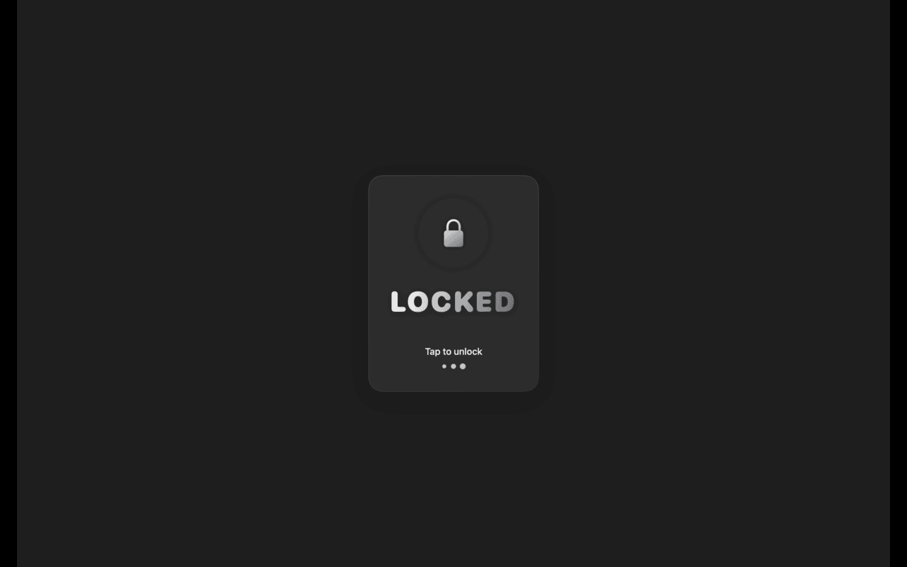
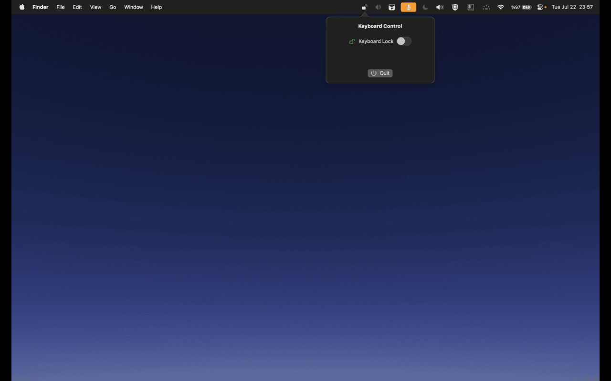
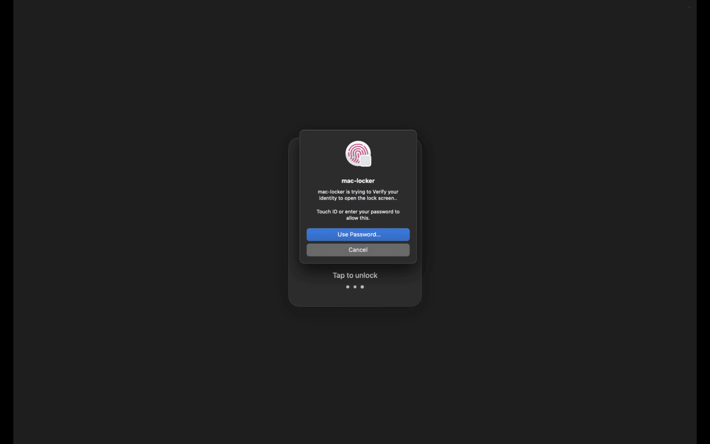
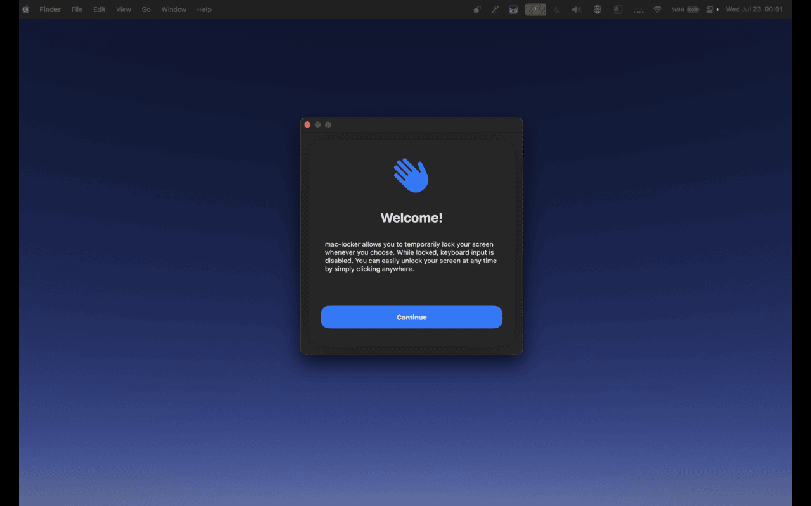

# TapLocks 🔒

Simple and beautiful macOS utility to temporarily lock your keyboard input.

<p align="center">
  
</p>

## ✨ Features

- ⌨️ Lock all keyboard input with a single toggle  
- 🔐 Unlock with Touch ID or password  
- 🌙 Clean, minimal macOS-style UI  
- 🚀 Lightweight & privacy-friendly  
- 📌 Runs quietly in the menu bar  

---

## 🧠 Why?

Sometimes you just need to walk away from your Mac without logging out or sleeping it. `TapLocks` gives you that peace of mind by locking input while keeping everything visible.

Perfect for:
- Shared desks and workspaces
- Avoiding accidental keystrokes
- Focus mode workflows
- Live demos and screen shares

---

## 🖥️ Screenshots

<p float="left">
  
  
  
  
</p>

---

## ⚙️ Installation

```bash
git clone https://github.com/akifkomurcu/TapLocks.git
cd TapLocks
open TapLocks.xcodeproj
